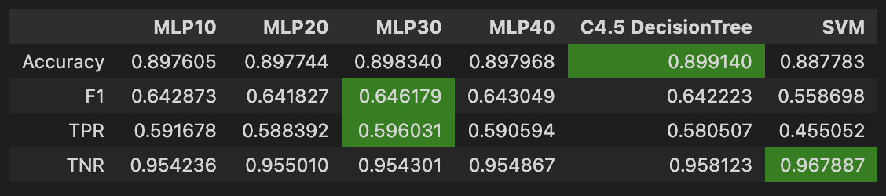

# 🛒 Online Shoppers Purchasing Intention – Marketing Optimization with AI

## 📌 Project Overview
This project explores and models online user behavior to predict purchasing intention and support the optimization of digital marketing campaigns. Using the Online Shoppers Purchasing Intention Dataset from the UCI Machine Learning Repository, we perform exploratory data analysis, statistical testing, and machine learning modeling to identify the factors that influence conversion.
The project also reproduces the methodology presented in the original research paper and extends it with modern machine learning pipelines.

## 🎯 Objectives
- Understand customer online behavior through EDA and statistical analysis
- Identify key factors influencing purchase decisions
- Build predictive models to classify purchasing intention
- Reproduce the baseline model from the original publication
- Develop a robust ML pipeline with feature selection and imbalance handling

## 🔍 Exploratory Data Analysis
- Distribution analysis of numerical and categorical features
- Conversion rate analysis
- Correlation and dependency exploration
- Behavioral insights (bounce rate, exit rate, page value, visitor type, etc.)

## 📐 Statistical Analysis
- Hypothesis testing (Chi-square, Mann–Whitney U, Kruskal–Wallis)
- Feature relevance assessment using  MRMR selection
- Analysis of how behavior metrics relate to conversion probability

## 🤖 Modeling
- Preprocessing with ColumnTransformer
- Class imbalance handling with SMOTE
- Feature selection using true MRMR
- Models implemented:
    - Logistic Regression
    - Random Forest
    - C4.5-style Decision Tree
- Metrics:
    - Accuracy
    - True Positive Rate (Recall+)
    - True Negative Rate (Recall−)
    - F1-score

## 📈 Results
- Performance comparison between models
- Reproduction of the original paper’s models

